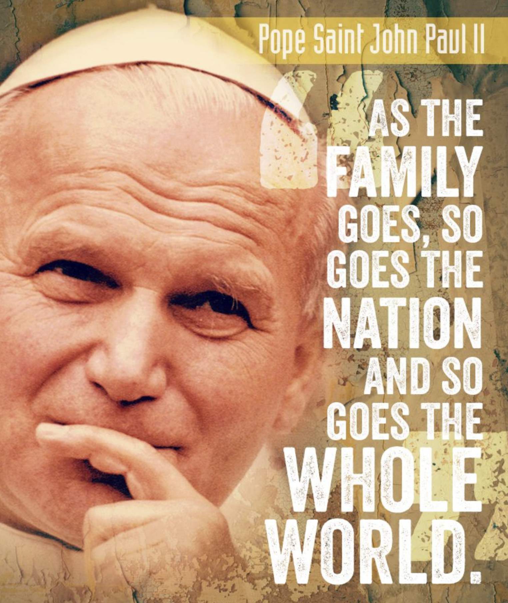

# Youth (18-35)
- [Youth 2000](http://www.youth2000.org/) - A Catholic youth organisation that organises retreats and prayer festivals for young people. Summer festival is open to a limited number of families
- [Jesus Youth](https://www.jesusyouth.co.uk) - A Catholic youth movement that organises retreats and prayer festivals for young people
- [Flame](https://www.cbcew.org.uk/flame-2025/) - A Catholic youth event that takes place every two years in the UK
- [Joel's Bar](https://www.joelsbar.com) - A Catholic youth (18-28) residential retreat, stemming from the Celebrate movement

# Teens
- [The Ascent](http://www.theascentuk.co.uk/) - A Catholic three-years discipleship programme (15-17)
- [Fanning the Flame](https://www.fanningtheflame.co.uk) - Summer camp for 12+
- [Faith Movement](http://www.faith.org.uk/) - A Catholic movement that organises a summer camp for 11-18 year olds
- [Jesus Youth Teens](https://www.jesusyouth.co.uk/teens-ministry.html) - A Catholic youth movement that organises retreats and prayer festivals for young people
- [Generation Hope - Mary's Meals](https://www.gen-hope.org/) - Glasgow-based movement that organises retreats for Scottish catholic secondary schools (12-15)

# Families
- [Celebrate](http://www.celebrateconference.org/) - A Catholic family conference that takes place in the UK
- [Sion Community for Evangelism](http://www.sioncommunity.org.uk/) - A Catholic community that organises retreats and prayer festivals, often aimed at families
- [We believe](https://www.webelievefestival.com) - A Catholic festival supported by the Guild of Our Lady of Ransom, aimed at families
- [New Dawn](https://princeofpeace.org.uk) - Weekend residential retreats for families organised by the Community of Christ Prince of Peace

# Diocesan youth services
- [Kenelm Youth Trust](https://www.kenelmyouthtrust.org.uk) - Summer Camps (11-18), pilgrimages, retreats and events for young people, based in the Archdiocese of Birmingham but open to all
- [Notts Diocesan Youth Service](https://www.ndcys.com) - Events, retreats and resources for young people in the Diocese of Nottingham. The retreat centre at The Briars is open to all, and is hosting a [Youth2000 Lent retreat for 16-35 year olds on March 22, 2025](https://www.youth2000.org/events/nottingham2025)

# Marriage
- [Teams of Our Lady](https://www.teamsgb.org.uk/) - A Catholic movement for married couples
- [Theology of the Body UK Network](https://www.tobnetworkuk.com) - An online group that promote the Theology of the Body in the UK

> **"It is Jesus that you seek when you dream of happiness; He is waiting for you when nothing else you find satisfies you; He is the beauty to which you are so attracted."**  
> *(St. John Paul II, World Youth Day 2000, Vigil at Tor Vergata, August 19, 2000)*

[Back to main page](../index.md)