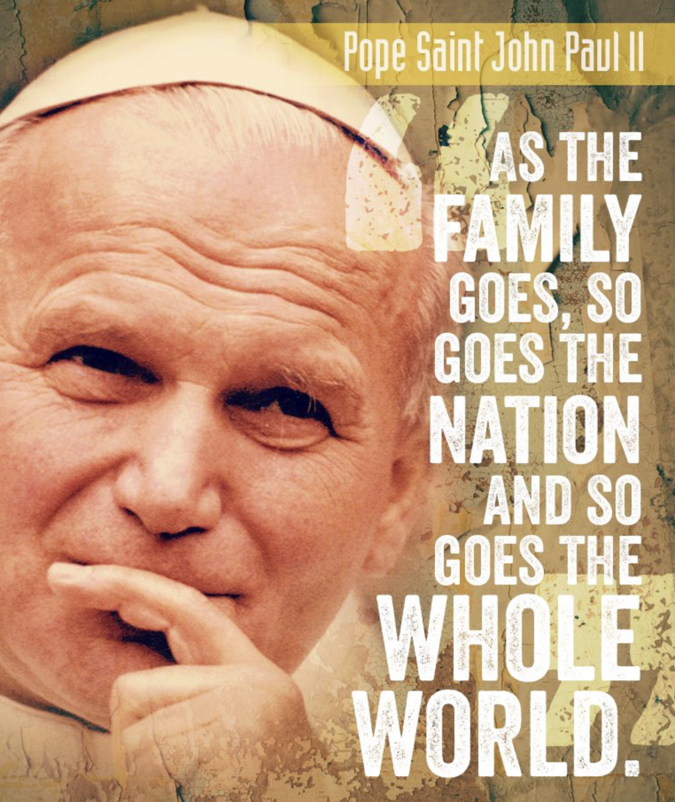

*Note: The parish is not responsible for the content of these personal resources.*

## Featured Resource

🆕 **[Passing the Faith to our Children](./passing-the-faith.md)** - A guide for family prayer, domestic church routines, and recommended resources for parents

> [!IMPORTANT]
> **Save the Date: The Well Event in Nottingham**
> **Christopher West & Mike Mangione**
> 📅 **Tuesday, 19th January 2027**
> 📍 **St Teresa's Church, Nottingham**
> An evening of beauty, reflection, and Eucharistic Revival featuring Christopher West and Mike Mangione. Tickets and webpage link to appear soon. Save the date!

## Autumn 2026 events

### Non-music & family events
- **20 Sep 2026 (Coventry, UK)** - [Sion Community Coventry Family Day](https://sioncommunity.org.uk/) - Family prayer and community afternoon at The Ark.
- **27 Sep 2026 (Luton, UK)** - [Sion Community Luton Family Day](https://sioncommunity.org.uk/) - Family day at the Holy Ghost Parish Centre.
- **29 Nov 2026 (Luton, UK)** - [Sion Community Luton Family Day](https://sioncommunity.org.uk/) - Family day at the Holy Ghost Parish Centre.

### Youth & Teen events
- **6–8 Nov 2026 (Sion Community, UK)** - [Sion Community D-Weekend (Years 7–9)](https://sioncommunity.org.uk/) - A faith-filled weekend with fun, games, worship, and small groups for younger teens.

## Winter & Spring 2027 events

### Family & Community
- **19 Jan 2027 (Nottingham, UK)** - **The Well Event with Christopher West & Mike Mangione** (see details above).
- **12–14 Feb 2027 (Storrington, UK)** - [Cana Valentine Weekend (Chemin Neuf)](https://www.chemin-neuf.org.uk/) - Valentine weekend for couples to rest, pray, and renew their love.
- **25–28 Mar 2027 (Dalmally, Argyll, Scotland)** - [Craig Lodge Easter Triduum](https://www.craiglodge.org/events) - Easter Triduum retreat for young adults and families.
- **1–2 May 2027 (UK)** - [Cana Family Weekend (Chemin Neuf)](https://www.chemin-neuf.org.uk/) - A weekend of rest, sharing, and family prayer.

### Youth & Teen events
- **6 Mar 2027 (OVO Arena Wembley, London)** - [Flame 2027](https://cymfed.org.uk/flame2027/) - The largest national Catholic youth event in the UK, organized by CYMFed (for young people in **Year 9 up to university age/young adults**).
- **28–31 May 2027 (Dalmally, Argyll, Scotland)** - [Stronghold Festival (Craig Lodge)](https://www.craiglodge.org/events) - 64 hours of non-stop worship, adoration, sacraments, and fellowship for youth and young adults.

### European events & pilgrimages
- **15–17 May 2027 (Paris to Chartres, France)** - [Paris-Chartres Pentecost Pilgrimage](https://www.nd-chretiente.com) - The traditional 3-day walking pilgrimage for families, youth, and children from Notre-Dame de Paris to Notre-Dame de Chartres.

## Summer 2027 events

### Non-music festivals & retreats (UK / Ireland / Scotland)
- **24–27 Jul 2027 (St Mary's College, Oscott, UK)** - [We Believe](https://www.webelievefestival.com) - Catholic family festival (talks, worship, sacraments, and activities for children, teens, and adults). Tickets available from Feb 2027.
- **July 2027 (UK, dates TBC)** - [Sion Community - Family Camp](https://sioncommunity.org.uk/) - Catholic community retreat for families with prayer, worship, formation, and fellowship.
- **July/August 2027 (Dalmally, Argyll, Scotland, dates TBC)** - [Craig Lodge - Green Pastures Family Weeks](https://www.craiglodge.org/ministries/families) - Catholic family retreat weeks featuring daily Mass, prayer, teaching, and a children’s programme.
- **Late July 2027 (Ampleforth Abbey, UK, dates TBC)** - [Faith Summer Session](https://www.faith.org.uk/events/) - Catholic residential summer conference (16–30) with daily Mass, talks, and prayer.
- **Late July / August 2027 (UK, dates TBC)** - [Cana Summer Week (Chemin Neuf)](https://www.chemin-neuf.org.uk/) - Catholic community week for couples/families to rest, pray, and grow together (with program for children).
- **August 2027 (Worth School, West Sussex, UK, dates TBC)** - [Celebrate Festival](https://www.celebratefestival.org/) - Catholic charismatic family festival featuring Mass, sacraments, worship, teaching, and children/youth programmes.
- **August 2027 (Walsingham, UK, dates TBC)** - [New Dawn Summer Conference](https://princeofpeace.org.uk/) - Catholic charismatic family conference (pending official updates following the community sabbatical).

### Music festivals (UK / Ireland / Scotland)
- **29 Jul – 1 Aug 2027 (Wiston Estate, West Sussex, UK)** - [Wildfires Festival](https://wildfiresfestival.com/wildfires/) - *Ecumenical Christian (non-Catholic)* worship & teaching festival with kids and youth programme.
- **27–29 Aug 2027 (Wiston Estate, West Sussex, UK)** - [Big Church Festival](https://bigchurchfestival.com/) - *Ecumenical Christian (non-Catholic)* worship/music festival with big youth and kids programmes.

### Summer camps (UK / Ireland / Scotland)
- **July/August 2027 (Ampleforth Abbey, UK, dates TBC)** - [Faith Northern Summertime (10–15)](https://www.faith.org.uk/events/) - Catholic residential holiday for children with Mass, talks, and activities.
- **Late July / August 2027 (Cromer, Norfolk, UK, dates TBC)** - [WEC Camps](https://www.weccamps.org/) - *Evangelical / inter-church (non-Catholic)* youth tent camps with Bible teaching, worship, sports, and beach activities.
- **Mid-August 2027 (Ascott, UK, dates TBC)** - [Faith Movement - Summer Break (11–15)](https://www.faith.org.uk/events/) - Catholic holiday/formation days for younger teens.
- **Mid-August 2027 (St Cassian's, Kintbury, UK, dates TBC)** - [Fanning the Flame](https://www.fanningtheflame.co.uk) - Catholic youth summer camp with praise & worship, Mass, adoration, confession, talks, and games.

### European events
- **July/August 2027 (Paray-le-Monial, France, dates TBC)** - [Sessions d'été pour tous (Emmanuel Community)](https://emmanuel.info) - Catholic summer sessions with tracks for families, youth, and children (talks, prayer, and worship).
- **27–31 Jul 2027 (Medjugorje, Bosnia & Herzegovina)** - [Youth 2000 Medjugorje Festival (Mladifest)](https://www.youth2000.org/) - Catholic pilgrimage to the Medjugorje Youth Festival (Mass, adoration, catechesis, and international youth programme).
- **August 2027 (Paray-le-Monial, France, dates TBC)** - [Jesus Festival](https://jesusfestival.fr/) - Catholic music festival featuring worship and Christian bands (family-friendly).

## Organisations (general links)

### Youth (18-35)
- [Youth 2000](http://www.youth2000.org/) - Catholic youth retreats and prayer festivals (some events open to families)
- [Jesus Youth](https://www.jesusyouth.co.uk) - Catholic missionary movement with retreats, prayer festivals and ministries
- [Flame](https://cymfed.org.uk/flame2027/) - Catholic youth event (next national gathering at Wembley on Saturday, 6 March 2027, open to **Year 9 up to university age/young adults**)
- [Joel's Bar](https://www.joelsbar.com) - Catholic residential retreat for young adults (18-28), from the Celebrate movement

### Teens
- [The Ascent](http://www.theascentuk.co.uk/) - Catholic three-year discipleship programme (15-17)
- [Fanning the Flame](https://www.fanningtheflame.co.uk) - Catholic summer camp for 12+
- [Faith Movement](https://www.faith.org.uk/) - Catholic movement with events and youth programmes (including summer camps/sessions)
- [Jesus Youth Teens](https://www.jesusyouth.co.uk/teens-ministry.html) - Jesus Youth teens ministry
- [Sion Youth](https://sioncommunity.org.uk/) - Youth ministry of the Sion Community, offering D-Weekends, youth retreats, and schools ministry
- [Generation Hope - Mary's Meals](https://www.gen-hope.org/) - Glasgow-based movement with retreats for Scottish Catholic secondary schools (12-15)

### Families
- [Celebrate (Trust)](https://www.celebratetrust.org/) - Catholic charismatic family events (including the Celebrate Festival)
- [Craig Lodge](https://www.craiglodge.org/) - Catholic family house of prayer in the Scottish Highlands (family weeks, retreats and Stronghold worship festival)
- [Sion Community](https://sioncommunity.org.uk/) - Catholic community with retreats and festivals (often family-focused)
- [We Believe](https://www.webelievefestival.com) - Catholic festival aimed at families
- [New Dawn](https://princeofpeace.org.uk/new-dawn/) - Catholic charismatic family conferences and retreats (Manchester/Walsingham). *Note: The August 2026 Walsingham conference was cancelled due to a community sabbatical.*
- [Chemin Neuf - Cana](https://www.chemin-neuf.org.uk/programmes/cana/) - Catholic community (*with ecumenical vocation*), supporting couples and families (Cana weeks/retreats)

### Diocesan youth services
- [Kenelm Youth Trust](https://www.kenelmyouthtrust.org.uk) - Summer camps (11-18), pilgrimages, retreats and youth events (Archdiocese of Birmingham, open to all)
- [Notts Diocesan Youth Service](https://www.ndcys.com) - Events, retreats and resources; The Briars retreat centre hosts open events

### Marriage
- [Teams of Our Lady](https://www.teamsgb.org.uk/) - Catholic movement for married couples
- [Theology of the Body UK Network](https://www.tobnetworkuk.com) - Online group promoting Theology of the Body in the UK

### Europe (Catholic)
- [Notre-Dame de Chrétienté (Paris-Chartres)](https://www.nd-chretiente.com) - Pentecost pilgrimage (France)
- [Emmanuel Community (Paray-le-Monial)](https://emmanuel.info) - Catholic community running summer sessions and retreats (France)
- [Jesus Festival](https://jesusfestival.fr/) - Catholic music festival (France)

> **"It is Jesus that you seek when you dream of happiness; He is waiting for you when nothing else you find satisfies you; He is the beauty to which you are so attracted."**  
> *(St. John Paul II, World Youth Day 2000, Vigil at Tor Vergata, August 19, 2000)*

---
[Back to Main Page](../index.md)
